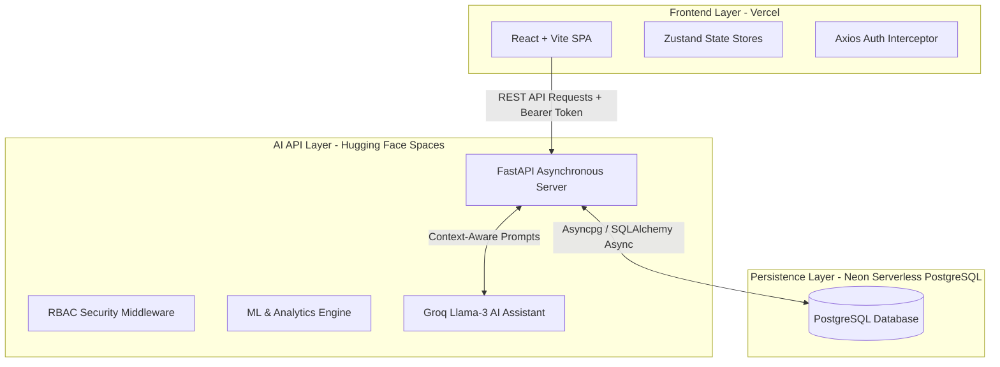
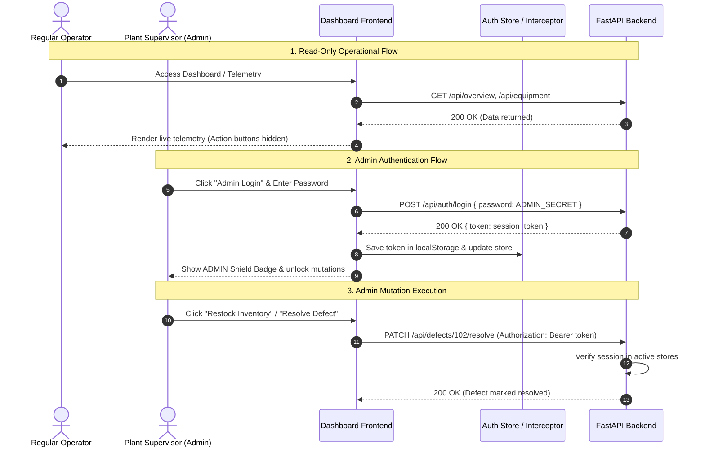
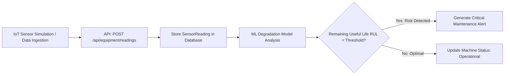
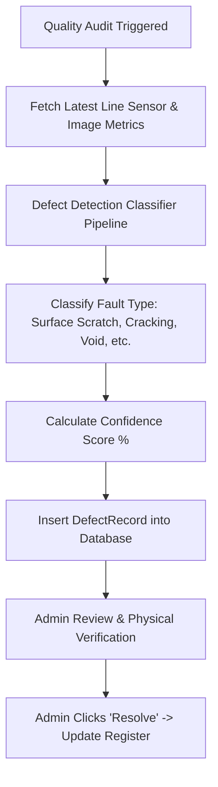
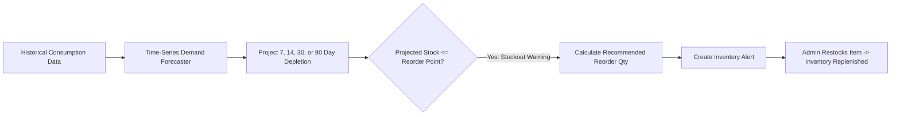
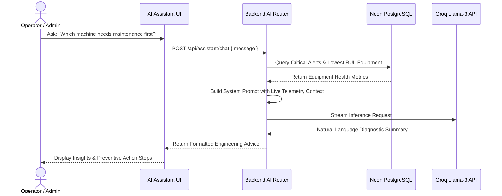

# AI Manufacturing Dashboard — System Architecture & Workflow Guide

Welcome to the **Sentry Fab AI Manufacturing Dashboard** workflow documentation. This guide details the end-to-end operational workflows, data pipelines, machine learning integration, and Role-Based Access Control (RBAC) architecture that power the platform.

---

## 1. High-Level Architecture Overview

The system operates on a modern, decoupled cloud infrastructure designed for low latency, real-time analytics, and high reliability:

| Layer | Technologies | Role & Purpose |
| :--- | :--- | :--- |
| **Frontend** | React, Vite, Vanilla CSS, Zustand, Lucide Icons | Premium glassmorphism UI, real-time dashboard telemetry monitoring, interactive charting, and role-sensitive action rendering. |
| **Backend** | Python 3.11, FastAPI, Pydantic, SQLAlchemy Async | Handles REST API endpoints, input validation, ML model inference, background tasks, and authentication guards. |
| **Database** | Neon Serverless PostgreSQL (`asyncpg`) | Persistent relational storage for equipment metadata, sensor logs, defect registries, inventory tracking, and system alerts. |
| **AI / ML Engine** | Scikit-Learn, NumPy, Groq Llama-3 API | Powers predictive degradation forecasting, vision/sensor defect classification, and natural language query resolution. |

---

## 2. Role-Based Access Control (RBAC) Workflow

To maintain production integrity while ensuring data visibility across the enterprise, the application divides capabilities into **Read-Only Operational Access** and **Admin Management Access**.

### Access Permission Matrix

| Feature / Page | Regular Operator (Unauthenticated) | Admin Supervisor (`ADMIN_SECRET`) |
| :--- | :---: | :---: |
| **View Telemetry & KPIs** | ✅ Full Visibility | ✅ Full Visibility |
| **Predictive Maintenance Charts** | ✅ Read-Only | ✅ Read-Only |
| **Ask AI Assistant Questions** | ✅ Unlimited Queries | ✅ Unlimited Queries |
| **Run Quality Scan Audits** | ❌ Hidden / Forbidden | ✅ Trigger Scan Audits |
| **Resolve Defect Records** | ❌ Hidden / Forbidden | ✅ Mark Defects Resolved |
| **Dismiss / Mark Alerts Read**| ❌ Hidden / Forbidden | ✅ Manage Alert Center |
| **Restock Inventory Orders** | ❌ Hidden / Forbidden | ✅ Execute Restocks |
| **System Settings & Data Seeding** | ❌ Locked / Redirected | ✅ Full Configuration Access |

---

## 3. Core Operational Pipelines

### A. Predictive Maintenance & Telemetry Pipeline
When equipment operates on the factory floor, telemetry readings flow through continuous monitoring loops:

1. **Ingestion**: Sensor metrics (temperature, vibration, acoustic pressure, RPM) are ingested via protected endpoints.
2. **Analysis**: The analytical engine calculates the **Health Score** and estimates the **Remaining Useful Life (RUL)** in hours based on stress tolerances.
3. **Automated Alerting**: If vibration or temperature exceeds designated thresholds, an anomaly alert is dispatched immediately to the **Alert Center**.

---

### B. Defect Detection Quality Audit Workflow
Automated anomaly classification scans product batches to identify manufacturing defects before shipments leave the facility:

---

### C. Inventory Demand Forecasting & Auto-Reorder Flow
To prevent assembly line shutdowns caused by stockouts, the inventory engine projects component depletion rates:

---

### D. Conversational AI Assistant Workflow
The integrated **Groq Llama-3** LLM acts as an expert manufacturing engineer, synthesizing live database context into actionable advice:

---

## 4. Summary of Key Files & Modules

| Component Area | Key Files | Description |
| :--- | :--- | :--- |
| **Security & Auth** | `backend/app/auth_deps.py` `backend/app/routers/auth.py` `frontend/src/store/useAuthStore.js` | Token generation, Bearer validation middleware, and frontend session persistence. |
| **Database & Config** | `backend/app/config.py` `backend/app/database.py` | Connection URL sanitization (removing driver-incompatible query flags for `asyncpg`) and async session lifecycle. |
| **ML & Analytics** | `backend/app/ml/predictive_maintenance.py` `backend/app/ml/defect_detection.py` `backend/app/ml/inventory_forecast.py` | Mathematical heuristics and predictive classification algorithms. |
| **User Interface** | `frontend/src/components/layout/Sidebar.jsx` `frontend/src/pages/AdminLogin.jsx` | Dynamic navigation menus, glowing RBAC badges, and interactive modals. |
